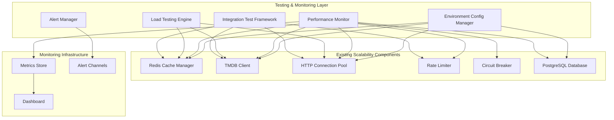

# Design Document: WaveFlix Hub Scalability Testing & Monitoring

## Overview

This design document outlines the technical architecture for implementing comprehensive testing and monitoring capabilities for WaveFlix Hub's scalability features. The system builds upon existing scalability components (Redis caching, TMDB API optimization, HTTP connection pooling, and rate limiting) to provide automated testing, performance monitoring, and environment management.

The design focuses on creating a robust testing framework that validates the integration of all scalability components while providing real-time monitoring and alerting capabilities. The architecture emphasizes observability, reliability, and performance validation through automated load testing and continuous monitoring.

## Architecture

### System Architecture Overview



### Component Integration Architecture

The testing and monitoring system integrates with existing scalability components through:

1. **Metrics Collection Interface**: Standardized metrics collection from all components
2. **Test Harness Interface**: Programmatic control and validation of component behavior
3. **Configuration Management Interface**: Centralized configuration validation and environment management
4. **Health Check Interface**: Unified health monitoring across all components

## Components and Interfaces

### 1. Integration Test Framework

**Purpose**: Validates that all scalability components work together seamlessly and deliver expected performance improvements.

**Core Components**:

- `IntegrationTestRunner`: Orchestrates comprehensive test scenarios
- `ComponentValidator`: Validates individual component functionality
- `PerformanceAssertion`: Measures and validates performance improvements
- `TestScenarioManager`: Manages different test scenarios and configurations

**Key Interfaces**:

```go
type IntegrationValidator interface {
    ValidateRedisIntegration(ctx context.Context) (*ValidationResult, error)
    ValidateTMDBIntegration(ctx context.Context) (*ValidationResult, error)
    ValidateHTTPPooling(ctx context.Context) (*ValidationResult, error)
    ValidateEndToEndPerformance(ctx context.Context) (*ValidationResult, error)
}

type ValidationResult struct {
    Component     string
    Success       bool
    Metrics       map[string]float64
    Diagnostics   []string
    Duration      time.Duration
}
```

### 2. Load Testing Engine

**Purpose**: Generates realistic load scenarios to validate scalability improvements under stress conditions.

**Core Components**:

- `LoadTestController`: Controls test execution and scaling
- `ScenarioGenerator`: Creates realistic user behavior patterns
- `MetricsCollector`: Collects performance data during tests
- `BaselineMeasurement`: Establishes and tracks performance baselines

**Key Interfaces**:

```go
type LoadTester interface {
    ExecuteLoadTest(scenario LoadTestScenario) (*LoadTestResults, error)
    GenerateUserScenarios(userCount int, duration time.Duration) []UserScenario
    MeasureBaseline() (*BaselineMetrics, error)
    ValidateCacheEfficiency(threshold float64) (*CacheValidationResult, error)
}

type LoadTestScenario struct {
    ConcurrentUsers   int
    Duration          time.Duration
    RequestPatterns   []RequestPattern
    ExpectedMetrics   map[string]float64
}
```

### 3. Performance Monitor

**Purpose**: Provides real-time monitoring of all scalability components with alerting capabilities.

**Core Components**:

- `MetricsAggregator`: Collects metrics from all components
- `AlertEngine`: Processes alerts based on thresholds and trends
- `DashboardService`: Provides real-time performance dashboards
- `HistoricalAnalyzer`: Analyzes trends and predicts capacity needs

**Key Interfaces**:

```go
type PerformanceMonitor interface {
    CollectMetrics(ctx context.Context) (*SystemMetrics, error)
    RegisterAlert(alert AlertDefinition) error
    GetRealTimeMetrics() (*RealTimeMetrics, error)
    AnalyzeTrends(period time.Duration) (*TrendAnalysis, error)
}

type SystemMetrics struct {
    RedisMetrics     *RedisMetrics
    TMDBMetrics      *TMDBMetrics
    HTTPPoolMetrics  *HTTPPoolMetrics
    DatabaseMetrics  *DatabaseMetrics
    SystemResources  *ResourceMetrics
}
```

### 4. Environment Configuration Manager

**Purpose**: Manages and validates configuration across different deployment environments.

**Core Components**:

- `ConfigValidator`: Validates configuration completeness and correctness
- `EnvironmentDetector`: Detects current environment and loads appropriate config
- `SecretManager`: Handles sensitive configuration data securely
- `ConfigTemplateManager`: Manages environment-specific configuration templates

**Key Interfaces**:

```go
type EnvironmentManager interface {
    ValidateConfiguration(env Environment) (*ConfigValidation, error)
    LoadEnvironmentConfig(env Environment) (*EnvironmentConfig, error)
    DetectEnvironment() Environment
    ValidateConnectivity() (*ConnectivityCheck, error)
}

type EnvironmentConfig struct {
    Redis      RedisConfig
    PostgreSQL PostgresConfig
    TMDB       TMDBConfig
    HTTP       HTTPConfig
}
```

## Data Models

### Metrics Data Models

```go
// RedisMetrics captures Redis performance and health data
type RedisMetrics struct {
    HitRate           float64   `json:"hit_rate"`
    MissRate          float64   `json:"miss_rate"`
    ResponseTime      time.Duration `json:"response_time_ms"`
    ConnectionsActive int       `json:"connections_active"`
    MemoryUsage       int64     `json:"memory_usage_bytes"`
    KeyCount          int       `json:"key_count"`
    Timestamp         time.Time `json:"timestamp"`
}

// TMDBMetrics captures TMDB API performance and rate limiting data
type TMDBMetrics struct {
    RequestRate       float64   `json:"requests_per_second"`
    ResponseTime      time.Duration `json:"response_time_ms"`
    RateLimitUtilization float64 `json:"rate_limit_utilization"`
    CircuitBreakerState string  `json:"circuit_breaker_state"`
    CacheHitRate      float64   `json:"cache_hit_rate"`
    ErrorRate         float64   `json:"error_rate"`
    Timestamp         time.Time `json:"timestamp"`
}

// HTTPPoolMetrics captures connection pool performance
type HTTPPoolMetrics struct {
    ActiveConnections int       `json:"active_connections"`
    IdleConnections   int       `json:"idle_connections"`
    ConnectionReuse   float64   `json:"connection_reuse_rate"`
    AverageLatency    time.Duration `json:"average_latency_ms"`
    ThroughputRPS     float64   `json:"throughput_rps"`
    Timestamp         time.Time `json:"timestamp"`
}
```

### Test Result Models

```go
// LoadTestResults captures comprehensive load test outcomes
type LoadTestResults struct {
    TestID            string              `json:"test_id"`
    Scenario          LoadTestScenario    `json:"scenario"`
    Duration          time.Duration       `json:"duration"`
    TotalRequests     int64               `json:"total_requests"`
    SuccessfulRequests int64              `json:"successful_requests"`
    FailedRequests    int64               `json:"failed_requests"`
    AverageLatency    time.Duration       `json:"average_latency"`
    P95Latency        time.Duration       `json:"p95_latency"`
    P99Latency        time.Duration       `json:"p99_latency"`
    ThroughputRPS     float64             `json:"throughput_rps"`
    CacheEfficiency   float64             `json:"cache_efficiency"`
    ComponentMetrics  map[string]interface{} `json:"component_metrics"`
    Timestamp         time.Time           `json:"timestamp"`
}

// BaselineMetrics establishes performance baselines
type BaselineMetrics struct {
    Version           string              `json:"version"`
    ResponseTime      time.Duration       `json:"response_time"`
    ThroughputRPS     float64             `json:"throughput_rps"`
    CacheHitRate      float64             `json:"cache_hit_rate"`
    DatabaseQueryTime time.Duration       `json:"database_query_time"`
    ComponentMetrics  map[string]float64  `json:"component_metrics"`
    Timestamp         time.Time           `json:"timestamp"`
}
```

### Configuration Models

```go
// TestingConfig defines testing framework configuration
type TestingConfig struct {
    IntegrationTests  IntegrationTestConfig `json:"integration_tests"`
    LoadTests         LoadTestConfig        `json:"load_tests"`
    Monitoring        MonitoringConfig      `json:"monitoring"`
    Environments      []Environment         `json:"environments"`
}

type IntegrationTestConfig struct {
    Timeout           time.Duration `json:"timeout"`
    RetryAttempts     int          `json:"retry_attempts"`
    ParallelExecution bool         `json:"parallel_execution"`
    ValidationThresholds map[string]float64 `json:"validation_thresholds"`
}

type LoadTestConfig struct {
    MaxConcurrentUsers int           `json:"max_concurrent_users"`
    RampUpDuration     time.Duration `json:"ramp_up_duration"`
    TestDuration       time.Duration `json:"test_duration"`
    MetricsInterval    time.Duration `json:"metrics_interval"`
    FailureThresholds  map[string]float64 `json:"failure_thresholds"`
}
```

## Error Handling

### Error Categories and Recovery Strategies

**1. Configuration Errors**

- **Detection**: Startup validation and health checks
- **Recovery**: Fallback to defaults, clear error messaging
- **Example**: Invalid Redis URL → fallback to memory cache with warning

**2. Component Integration Failures**

- **Detection**: Integration test failures, health check failures
- **Recovery**: Component isolation, graceful degradation
- **Example**: Redis unavailable → automatic memory cache fallback

**3. Load Test Failures**

- **Detection**: Performance threshold violations, error rate spikes
- **Recovery**: Test termination, diagnostic collection, baseline comparison
- **Example**: Response time > 2x baseline → halt test, collect diagnostics

**4. Monitoring Failures**

- **Detection**: Metric collection failures, alert delivery failures
- **Recovery**: Fallback monitoring, local logging, manual notification
- **Example**: Dashboard service down → continue logging metrics locally

### Error Handling Patterns

```go
type ErrorHandler interface {
    HandleConfigurationError(err ConfigurationError) error
    HandleComponentFailure(component string, err error) error
    HandleTestFailure(testID string, err error) error
    HandleMonitoringFailure(err error) error
}

type ErrorRecoveryStrategy struct {
    RetryCount      int
    BackoffStrategy BackoffType
    FallbackAction  func() error
    AlertSeverity   AlertLevel
}
```

## Testing Strategy

### Integration Testing Approach

**Test Categories**:

1. **Component Integration Tests**

   - Redis cache integration with database operations
   - TMDB client integration with rate limiting
   - HTTP pool integration with external APIs
   - End-to-end request flow validation

2. **Performance Validation Tests**

   - Cache hit rate validation (>80% for frequent data)
   - Response time improvement measurement
   - Throughput increase validation
   - Resource utilization optimization

3. **Resilience Testing**

   - Redis failover to memory cache
   - Rate limit handling under load
   - Circuit breaker activation and recovery
   - Connection pool exhaustion handling

4. **Environment Configuration Tests**
   - Configuration validation across environments
   - Connectivity verification
   - Credential validation
   - Fallback mechanism testing

### Load Testing Strategy

**Test Scenarios**:

1. **Realistic User Patterns**

   - Movie browsing sessions
   - Search query patterns
   - Trending content access
   - Watch provider lookups

2. **Stress Testing**

   - Peak concurrent user loads
   - Database connection limits
   - Cache capacity limits
   - API rate limit boundaries

3. **Endurance Testing**
   - Extended duration tests (1+ hours)
   - Memory leak detection
   - Connection pool stability
   - Cache performance over time

**Performance Benchmarks**:

- Response time: <200ms for cached content, <500ms for fresh API calls
- Throughput: >1000 requests/second sustained
- Cache efficiency: >80% hit rate for movie/TV data
- Error rate: <1% under normal load, <5% under stress

## Correctness Properties

_A property is a characteristic or behavior that should hold true across all valid executions of a system-essentially, a formal statement about what the system should do. Properties serve as the bridge between human-readable specifications and machine-verifiable correctness guarantees._

### Property 1: Configuration Validation Correctness

_For any_ configuration object with Redis, PostgreSQL, or TMDB parameters, the validation logic should correctly identify valid configurations as valid and invalid configurations as invalid, with specific error messages for each validation failure.

**Validates: Requirements 2.1, 2.2, 2.3, 2.5, 10.1, 10.2, 10.3, 10.4, 10.5**

### Property 2: Alert Threshold Triggering

_For any_ performance metric value and configured threshold, alerts should be triggered if and only if the metric value exceeds the threshold, with appropriate alert levels and escalation policies applied.

**Validates: Requirements 3.6, 8.2**

### Property 3: Load Test Scenario Generation

_For any_ user count and duration configuration, the load test generator should produce realistic user scenarios that maintain the specified concurrency and duration constraints.

**Validates: Requirements 4.1**

### Property 4: Performance Metrics Calculation

_For any_ set of raw performance data (response times, request counts, cache hits/misses), the calculated metrics (averages, percentiles, hit rates, throughput) should be mathematically correct and consistent.

**Validates: Requirements 4.2, 5.1, 7.5, 8.3**

### Property 5: Cache Efficiency Validation

_For any_ cache access pattern with hits and misses, the efficiency calculation should correctly determine if the cache hit rate meets the specified threshold (e.g., 80%) and cache invalidation should maintain data freshness while optimizing performance.

**Validates: Requirements 4.3, 5.3, 5.5**

### Property 6: Performance Degradation Detection

_For any_ performance baseline and current performance measurements, the system should correctly detect when performance degrades below acceptable thresholds and trigger appropriate halt or alert actions.

**Validates: Requirements 4.6, 9.4**

### Property 7: Rate Limiting Enforcement

_For any_ request pattern and rate limit configuration, the rate limiter should enforce limits correctly, implement proper backoff with jitter, and queue requests appropriately when limits are exceeded.

**Validates: Requirements 6.1, 6.2, 6.4**

### Property 8: API Response Caching Logic

_For any_ API response and freshness requirements, the caching decision should correctly balance data freshness against performance optimization based on the specified TTL and staleness tolerance.

**Validates: Requirements 6.3**

### Property 9: Connection Pool Optimization

_For any_ connection pool configuration and request load, the pool should optimize sizing based on utilization patterns and correctly queue requests when capacity is reached with appropriate timeout and retry policies.

**Validates: Requirements 7.1, 7.4**

### Property 10: Baseline Performance Management

_For any_ performance data over time, baseline establishment and updates should correctly identify performance trends, detect regressions, and provide accurate capacity planning predictions.

**Validates: Requirements 9.1, 9.2, 9.3**

### Property 11: Performance Analysis and Reporting

_For any_ performance dataset, correlation analysis should correctly identify relationships between component performance and system health, and generate actionable optimization recommendations.

**Validates: Requirements 8.4, 9.5**

### Unit Testing for Testing Framework

**Test Coverage Areas**:

- Metrics collection accuracy
- Alert threshold detection
- Configuration validation logic
- Load test scenario generation
- Performance calculation algorithms

**Testing Tools**:

- Go testing framework for unit tests
- Docker containers for integration testing
- Mock services for external dependencies
- Performance profiling tools for optimization

**Property-Based Testing Configuration**:

- Minimum 100 iterations per property test
- Each property test references its design document property
- Tag format: **Feature: scalability-testing-monitoring, Property {number}: {property_text}**
- Properties focus on algorithms and calculations, not infrastructure integration
